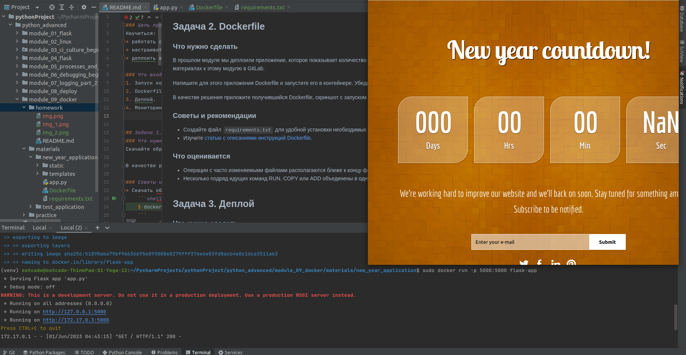

## Практическая работа 9
### Цель практической работы
Научиться:
* работать с Docker-контейнерами;
* настраивать Dockerfile;
* деплоить веб-приложение с помощью Docker.

### Что входит в практическую работу
1. Запуск контейнера.
2. Dockerfile.
3. Деплой.
4. Мониторинг контейнера.


## Задача 1. Запуск контейнера
### Что нужно сделать
Скачайте образ `andreyshulaev1/test_app`, который мы создали в ходе текущего модуля. Создайте из него контейнер и запустите на порту 5050. Убедитесь, что приложение работает и отвечает по URL `http://0.0.0.0:5050/hello/user`.

В качестве решения приложите скриншот с запуском Docker-контейнера и ответом приложения.

### Советы и рекомендации
* Скачать образ можно с помощью команды docker pull:
    ```shell
    $ docker pull andreyshulaev1/test_app
    ```
* Воспользуйтесь curl для проверки работы приложения:
    ```shell
    $ curl http://0.0.0.0:5050/hello/user
    ```

### Что оценивается
* Контейнер запускается на порту 5050.
* Приложение отвечает по заданному URL.

## Задача 2. Dockerfile
### Что нужно сделать
В прошлом модуле мы деплоили приложение, которое показывает количество дней до Нового года. Вы можете найти его в материалах к этому модулю в GitLab.

Напишите для этого приложения Dockerfile и запустите его в контейнере. Убедитесь, что всё работает.

В качестве решения приложите получившийся Dockerfile, скриншот с запуском контейнера и открытым в браузере сайтом

### Советы и рекомендации
* Создайте файл `requirements.txt` для удобной установки необходимых зависимостей в контейнере.
* Изучите [статью с описаниями инструкций Dockerfile](https://habr.com/ru/company/ruvds/blog/439980/).

### Что оценивается
* Операции с часто изменяемыми файлами располагаются ближе к концу файла.
* Несколько подряд идущих команд RUN, COPY или ADD объединены в одну.


## Задача 3. Деплой
### Что нужно сделать
1. Зарегистрируйтесь на [Docker Hub](https://hub.docker.com/).
2. Установите Docker на удалённый сервер (тот, куда вы деплоили приложение в прошлом модуле).
3. Создайте репозиторий и загрузите туда образ с приложением.
4. Разверните созданный образ на этом сервере.

В качестве решения приложите ссылку на ваш образ в Docker Hub и скриншот работающего удалённого сайта.

### Советы и рекомендации
Чтобы образ сам перезапускался при перезагрузке системы, добавьте ключ в команду запуска: 
`--restart=always`. [Подробнее о том, как это работает](https://docs.docker.com/config/containers/start-containers-automatically/).
### Что оценивается
На скриншоте виден URL страницы.

## Задача 4. Мониторинг контейнера
### Что нужно сделать
Мы оставили одну команду на самостоятельное изучение — `exec`. По синтаксису она очень похожа на команду `docker run` и делает почти то же самое, только не для образов, а для уже запущенных контейнеров.

Допустим, у нас есть запущенное приложение, но работает оно как-то не так. Попробуйте запустить какой-нибудь контейнер и выполнить команду:

```shell
$ docker exec -it <id_контейнера> uptime
```

Теперь сделаем что-нибудь сложное и интересное, например помониторим запущенное приложение.

Для начала нужно зайти в сам контейнер в интерактивном режиме. Обновите индекс доступных пакетов и установите программу `htop`. Запустите её и узнайте, сколько памяти потребляет система внутри контейнера. Не выходя из запущенного контейнера, узнайте, куда установилась программа `htop`.

В качестве решения приложите скриншот с результатом работы `htop` в запущенном контейнере.


### Советы и рекомендации
* [Документация команды docker exec](https://docs.docker.com/engine/reference/commandline/exec/).
* Узнать, куда установилась программа, можно с помощью команды which:
    ```shell
    $ which htop
    ```

### Что оценивается
* Команда `htop` запущена в интерактивном режиме.
* Используется уже запущенный контейнер.

## Общие советы и рекомендации
* Располагайте команды в Dockerfile по частоте изменений. 
Docker выполняет кеширование каждого шага для ускорения выполнения следующих шагов. Размещайте слои, которые, вероятнее всего, будут меняться, как можно ближе к концу файла.
* Минимизируйте количество слоёв, объединяя команды. Это приведёт к уменьшению размера образа. Например, команды
    ```dockerfile
    RUN apt-get update
    RUN apt-get install -y htop
    ```
    можно объединить в одну:
    ```dockerfile
    RUN apt-get update && apt-get install -y htop
    ```
* Старайтесь использовать в `CMD` массивы вместо строк. Дело в том, что строковая форма приводит к запуску процесса с использованием `bash`, поэтому сочетание клавиш `Ctrl + C` может не сработать.

## Что оценивается в практической работе
Представлены скриншоты или другие материалы, показывающие, что задачи выполнены успешно.
