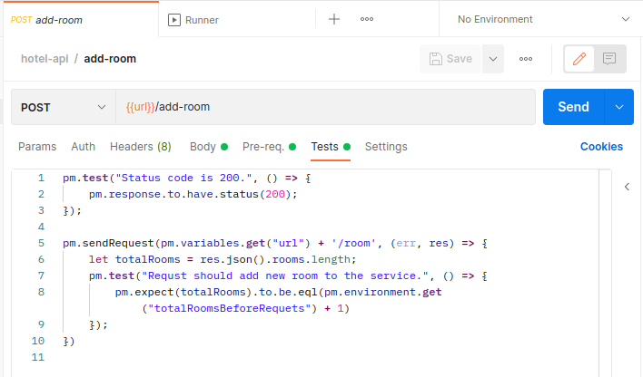
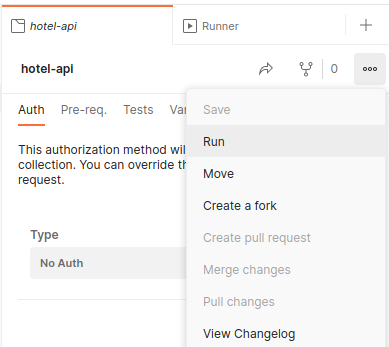

# Практическая работа, модуль 15

## Цели практической работы

* Познакомиться с протоколом HTTP и его методами.
* Научиться реализовывать JSON API и использовать модель Ричардсона для оценки зрелости API.
* Попрактиковаться в технике Test Driven Development.
* Познакомиться с функционалом коллекций и тестов в Postman.

## Что входит в практическую работу

1. TDD — разработка через тестирование.
2. Повышаем уровень зрелости.

Перед выполнением работы прочитайте следующие статьи:

* [Строка запроса](https://ru.abcdef.wiki/wiki/Query_string)
* [JSON Schema](https://habr.com/ru/post/495766/)

## Задача 1. TDD — разработка через тестирование

### Что нужно сделать

Заказчик составил для вас контракт веб-сервиса, который вы должны реализовать. Да ещё был так любезен, что написал для
вас тесты. Ваша задача — создать такое API, чтобы все тесты прошли и функционал соответствовал ожиданиям.

Postman позволяет писать тесты на API. Чтобы тесты отработали корректно, нужно запускать их разом, так как в некоторых
из них устанавливаются необходимые переменные.



Для запуска на странице коллекции нажмите три точки, а затем Run.

В появившемся окне оставьте настройки по умолчанию и снова нажмите Run.

Код тестов можно посмотреть на странице запроса во вкладке Tests. Тесты написаны на JavaScript. Не пугайтесь: принцип
такой же, как в тестировании с помощью `unittest`, просто будет другой синтаксис.



Вместе с реализованным веб-сервисом приложите скриншот с прохождением всех тестов в Postman.

### Советы и рекомендации

* [Примеры тестовых сценариев Postman](https://infostart.ru/1c/articles/1545930/).
* Для сериализации объекта в JSON удобно воспользоваться
  классом [JSONEncoder](https://docs.python.org/3/library/json.html#module-json).
* Обратите внимание на коды ответа HTTP, требуемые в тестах. В endpoint код ответа можно указать так:

   ```python
   @app.route('/endpoint')
   def endpoint():
      return 'Произошел конфликт', 409
   ```

### Что оценивается

* Приложен скриншот с прохождением всех тестов в Postman.
* Модели и бизнес-логика вынесены в отдельные модули.
* Для работы с данными используется БД.

## Задача 2. Повышаем уровень зрелости

### Что нужно сделать

Заказчик не знает про модель зрелости API, да и вообще про принципы построения качественного API. Он это осознаёт,
поэтому попросил вас помочь внести правки в контракт.

Найдите, что можно улучшить, и оформите это в виде Postman-коллекции, прокомментировав изменения в файле `REPORT.md`.

### Что оценивается

* Определён текущий уровень зрелости.
* Обращено внимание на названия endpoint и параметров.
* Изменённый контракт оформлен в виде Postman-коллекции.
* Все изменения в контракте обоснованы и записаны в `REPORT.md`.

## Что оценивается в практической работе

* Имеется разделение кода на отдельные независимые модули: модели, бизнес-логика, контроллер.
* При работе с БД используются параметризованные запросы.
* Названия переменных, функций и классов имеют значащие имена.
