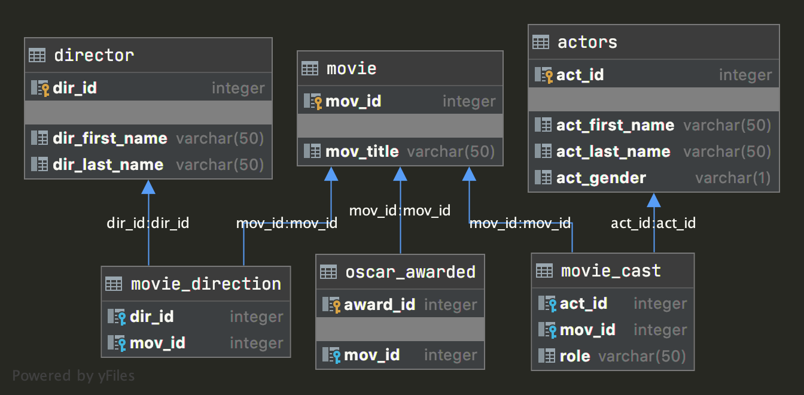

# Практическая работа, модуль 16
В практической работе есть обязательные и дополнительные задачи.

_Обязательные задачи_ помогут проверить, как вы усвоили материал модуля. Их нужно сдать на проверку куратору.

Дополнительные задачи выполнять необязательно. Они подойдут тем, кто хочет ещё немного потренироваться, решая усложнённые задачи по программированию. Вы также можете отправить их на проверку и получить обратную связь куратора.

## Цели практической работы
* Научиться создавать таблицы, используя первичный и внешний ключи.
* Получить опыт в создании таблиц с разными видами связей.
* Научиться агрегировать данные из таблиц, используя JOIN.

## Что входит в практическую работу
**Обязательные задачи:**

1. Создание схемы.
2. SQL-запросы.

**Дополнительная задача:**

3. Упражнения на сайте sql-ex.ru.

## Задача 1. Создание схемы
### Что нужно сделать
Реализуйте следующие таблицы:
  


SQL-запросы для создания схемы оформите в SQL-файле или в Python-скрипте. 

Подумайте, как должны вести себя ссылки при удалении родительских записей.

В отдельном файле напишите классификацию всех типов связей между таблицами в схеме.

### Рекомендации
* [Ограничение целостности внешнего ключа](https://www.sqlitetutorial.net/sqlite-foreign-key/)
* Выполнить SQL-скрипт из файла можно так:

   ```python
   import sqlite3
   
   with open('create_schema.sql', 'r') as sql_file:
      sql_script: str = sql_file.read()
   
   with sqlite3.connect('database.db') as conn:
      cursor: sqlite3.Cursor = conn.cursor()
      cursor.executescript(sql_script)
      conn.commit()
  ```
### Что оценивается
* Диаграмма созданной схемы соответствует диаграмме из условия.
* Соблюдены ограничения целостности внешнего ключа.
* Приведена классификация всех пяти видов связей между таблицами.

## Задача 2. SQL-запросы
### Что нужно сделать
Запустите скрипт `generate_hw_database.py`, чтобы подготовить базу данных.

Выполните следующие запросы:

1. Найдите и выведите всю информацию о каждом заказе:
   * имя покупателя,
   * имя продавца,
   * сумму,
   * дату.
2. Найдите и выведите имена покупателей, которые не сделали ни одного заказа.
3. Выведите номер заказа, имена продавца и покупателя, если место жительства продавца и покупателя не совпадают.
4. Для покупателей, которые сделали заказ напрямую (без помощи менеджеров), выведите имена и номера заказов.
5. _По желанию_. Выведите имена уникальных пар покупателей, живущих в одном городе и имеющих одного менеджера.

Получившиеся SQL-запросы оформите в отдельных файлах `2_X.sql`, где `X` — номер подзадачи.

## Задача 3. Упражнения на сайте sql-ex.ru (по желанию)
### Что нужно сделать
Выполните упражнения:

* https://www.sql-ex.ru/learn_exercises.php?LN=6
* https://www.sql-ex.ru/learn_exercises.php?LN=7
* https://www.sql-ex.ru/learn_exercises.php?LN=9
* https://www.sql-ex.ru/learn_exercises.php?LN=36
* https://www.sql-ex.ru/learn_exercises.php?LN=50

Получившиеся SQL-запросы оформите в отдельных файлах `3_X.sql`, где `X` — номер упражнения на сайте.

### Общие рекомендации
* [Операторы JOIN](https://www.sqlitetutorial.net/sqlite-join/)
* [Оператор UNION](https://www.sqlitetutorial.net/sqlite-union/)
### Что оценивается
* Для объединения таблиц по общему столбцу применяется верный тип JOIN.
* Для объединения строк таблиц используется UNION.
